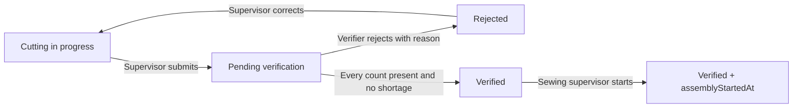

# ApparelFlow production gate

Next.js + TypeScript + Tailwind CSS + PostgreSQL + Prisma implementation of Webtezza's **Production Batch Verification & Sewing Queue Gate**. This repository covers that module only.

## Local setup

Requires Node.js 24 LTS and npm. Dependencies are locked in `package-lock.json`.

```sh
npm ci
npm run db:generate
npm run db:local
```

Keep the last command running. It launches real PostgreSQL bound to `127.0.0.1:54329`, stores data in ignored `.postgres/`, generates a random local database password, and writes ignored `.env` and `.env.test` files only when absent. It creates `apparelflow` and `apparelflow_test`. It does not install a system service. Stop with Ctrl+C; data survives restart. The optional embedded binary package is a development convenience; deployment uses managed PostgreSQL.

In another terminal:

```sh
npm run db:migrate
npm run db:seed
npm run dev
```

Open http://localhost:3000. The public demonstration password created by the helper is **`ApparelFlow-Demo-2026!`**. The login panel displays it and authenticates the selected account on the server.

| Role | Email | Allowed actions |
|---|---|---|
| Cutting Supervisor | cutting_supervisor@apparelflow.demo | Create/correct cutting preparations, submit, track orders |
| Cutting Verifier | cutting_verifier@apparelflow.demo | Count pending batches, save counts, approve or reject |
| Sewing Supervisor | sewing_supervisor@apparelflow.demo | Read verified batches and their audit history; start assembly |

The seed command uses `DEMO_PASSWORD`, requires at least 12 characters, and updates the three account passwords if rerun. It creates exact recipes only when absent; it does not silently rewrite existing recipe data.

### Existing PostgreSQL or Docker

Copy `.env.example` to `.env`, set `DATABASE_URL`, `APP_ORIGIN` and `DEMO_PASSWORD`. Set `NEXT_PUBLIC_DEMO_PASSWORD` to the same **disposable demo password** if it should be visible. For Docker, set `POSTGRES_PASSWORD` in your shell and run `docker compose up -d db`; use that password in `DATABASE_URL`. Then generate, migrate and seed as above. Do not run `db:local` against an existing remote configuration.

| Variable | Purpose |
|---|---|
| `DATABASE_URL` | PostgreSQL connection string; use provider-required TLS in cloud |
| `APP_ORIGIN` | Exact permitted browser origin, e.g. `https://your-app.example` (no trailing slash) |
| `DEMO_PASSWORD` | Seed-time password for all three demonstration users |
| `NEXT_PUBLIC_DEMO_PASSWORD` | Optional password shown in the demo panel; public and embedded at build time |
| `TEST_PRODUCTION` | `1` runs tests against `next start` after a build; otherwise tests use development server |

Database credentials must never use `NEXT_PUBLIC_`. `.env*`, local PostgreSQL data and tool downloads are ignored by Git.

## Architecture and code tour

The React workspace in [`src/app/page.tsx`](src/app/page.tsx) shows only controls appropriate to the signed-in role. This improves usability; it is not the permission boundary.

[`src/app/api/[...path]/route.ts`](src/app/api/%5B...path%5D/route.ts) authenticates every protected request and checks the role **before** parsing action data. [`src/lib/security.ts`](src/lib/security.ts) uses salted scrypt hashes (`N=32768,r=8,p=1`), timing-safe comparison, random 256-bit opaque session tokens, and database-backed eight-hour sessions. Only token hashes are stored. Cookies are HttpOnly, SameSite=Lax and Secure in production. Switching roles revokes the current session and creates a new authenticated session. Writes reject foreign browser origins.

[`src/lib/workflow.ts`](src/lib/workflow.ts) contains the domain rules. A PostgreSQL row lock serializes changes to each order. Each mutation also requires the current `version`, so stale or duplicate actions receive HTTP 409. Approval, final counts, status and audit snapshot commit in one transaction. A failure rolls everything back.

The server derives component expectations and wastage from database recipes and quantities. Strict Zod schemas reject extra fields, strings masquerading as numbers, duplicates and unknown components. The client cannot supply expected quantities, roles, audit identity, timestamps, wastage or status.



The PDF does not name an assembly status. `assemblyStartedAt` records that action while status remains `VERIFIED`; the queue always executes a server-owned `WHERE status = 'VERIFIED'`. Query parameters cannot replace that predicate. The queue includes started batches with an explicit label; the start action cannot be repeated.

### Relational schema

| Entity | Relationships and integrity |
|---|---|
| User | Unique email; role; password hash; orders, sessions and verification logs |
| Session | Hashed token primary key; user foreign key; indexed expiry |
| Recipe | Unique code, category, positive decimal standard yards, wastage cap |
| RecipeComponent | Recipe foreign key, positive pieces/garment, optional image URL; unique recipe/name |
| CuttingOrder | Recipe and creator foreign keys; unique sequence number; status, version, fabric, timestamps |
| VerificationItem | Order/component foreign keys; unique pair; expected/actual counts and consistent traffic light |
| VerificationLog | Order/verifier foreign keys; decision, reason, server timestamp, wastage and full immutable snapshot |

Indexes support status/date queue filtering, creator lookup and order audit history. SQL migrations add numeric checks, a partial unique index permitting one approval, append-only log triggers, and triggers freezing approved order details and counts. Approved assembly timestamps cannot be rewritten. Database owners can alter their schema; use restricted runtime credentials in deployed environments.

### Counts and fabric assumptions

Garments: integers 1–100,000. Component counts: integers 0–10,000,000. Zero is a shortage, not an empty count. An empty saved count is null and cannot pass. Fabric: positive numeric yards up to four decimal places (maximum 10,000,000).

The PDF's blanket ban on decimals conflicts with its 1.8/1.1 yard recipe standards. Decimal **fabric** is therefore allowed; decimal **counts** are rejected. `expected fabric = target quantity × standard yards`; wastage is `(actual − expected) / expected × 100`, calculated using decimal arithmetic on the server. Negative wastage is retained. Exceeding the cap displays a warning and does not create an unspecified approval block. The immediate creation preview is advisory; stored values are recomputed on the server.

Green means actual equals expected; yellow means excess and may pass; red means shortage and cannot pass. A complete decision includes each component exactly once. **Save counts** persists partial counting; approval and rejection also persist their submitted counts. Unsaved form edits are not database records.

## Verification

```sh
npm test
npm run typecheck
node scripts/contrast.mjs
npm run build
```

`npm test` requires `.env.test` with a dedicated PostgreSQL database name ending in `_test`. The local helper creates it. For a managed test database, copy `.env.example` to `.env.test` and point it to a separate database; set the demo password and origin `http://localhost:3100`. The runner refuses a database without the `_test` suffix, applies migrations, seeds, starts a real HTTP server on port 3100, then executes the integration suite. It never resets or drops the database. Repeated runs add isolated test orders. Port 3100 must be free.

Tests cover the five required cases plus excess, malformed/missing/duplicate/unknown counts, unauthorized order/queue access, forged authority, stale versions, concurrent approval, correction history, invalid transitions, assembly, persisted counts, and direct SQL immutability. See [`tests/integration.test.ts`](tests/integration.test.ts). CI runs against a separate PostgreSQL 17 service and the production server.

For production-server verification locally: build first, then set `TEST_PRODUCTION=1` in your shell and run `npm test`. The contrast script checks the declared palette mathematically; it does **not** verify rendered focus, layout, native dropdowns or mobile behavior.

Actual results and outstanding checks are in [`VERIFICATION.md`](VERIFICATION.md). Requirements and implementation links are in [`REQUIREMENTS.md`](REQUIREMENTS.md).

## Five-minute demonstration

1. Sign in as Cutting Supervisor. Create Casual Blouse, 50 garments, roll `FAB-ROLL-882`, actual fabric `94.5`. Explain 100 sleeves and 100 cuffs, expected fabric 90 yards and 5% wastage. Save preparation, open it and submit.
2. Sign out and sign in as Cutting Verifier. Order creation is absent. Open the batch. Enter 49 front panels and correct counts elsewhere: approval stays disabled and the shortage is red. Save counts; refresh and reopen to demonstrate persistence.
3. Enter a reason, reject, then switch to Cutting Supervisor. Open the rejected batch, edit/correct, save and submit again. The earlier audit remains.
4. Switch to Cutting Verifier and enter 50, 50, 100, 50 and 100 for the five Casual Blouse components by their labels. Approve. Show the attribution, timestamp and immutable snapshot. Try an excess count on another batch to explain yellow.
5. Switch to Sewing Supervisor. Only verified batches appear. Open the approved batch and start assembly, then refresh. Explain that changing a browser variable or URL cannot grant permissions; the HTTP tests demonstrate direct tamper rejection.

Before submission, use a connected browser to inspect desktop/mobile layout, keyboard focus, every input and dropdown, and all three role workflows. This session could not perform that visual review because no browser was connected.

## Deployment and public repository handoff

The application has been prepared locally, not published. To publish, provide access to the target GitHub account/organization (authenticated Git or the GitHub connector), a repository name, and a hosting project with access to set environment variables. A managed PostgreSQL connection string is also required. Use the provider's secret settings rather than pasting credentials into source files.

1. Create a **public** GitHub repository and push the actual local commit history. Do not include `.env*`, `.postgres`, `.tools` or `node_modules`.
2. Provision persistent PostgreSQL. Use a direct connection for `prisma migrate deploy`; if the runtime uses a connection pool, ensure interactive transactions are supported and use the provider's Prisma guidance.
3. Configure `DATABASE_URL`, exact HTTPS `APP_ORIGIN`, `DEMO_PASSWORD` and the optional public demo password. Run migrations and seed against that database. When seeding from provider environment variables without an `.env` file, run `npx tsx prisma/seed.ts`.
4. On a Node.js hosting service use `npm ci && npm run build` to build and `npm start` to serve. Run migrations as a release step. On Vercel, import the repository using the Next.js preset and the same build command. This is a server application; static GitHub Pages hosting will not work.
5. Open the deployed URL, execute the walkthrough and run API checks against a separate hosted test database. Verify HTTPS cookies and the exact origin. Confirm the final repository is public and the URL remains live for the evaluator.

For real factory use beyond this assessment, remove public demonstration credentials, provision individual accounts, configure provider-level authentication rate limiting, monitoring and backups, and add pagination beyond the latest 200 batches. These operational extensions are not represented as completed.

## Engineering review

See [`AI_OPTIMIZATION_REPORT.md`](AI_OPTIMIZATION_REPORT.md) for genuine AI defects and corrections, and [`IMPLEMENTATION_PLAN.md`](IMPLEMENTATION_PLAN.md) for the four-day plan. The report attributes AI work honestly. The candidate still needs to review the code and explain the decisions personally; this repository does not claim that review has happened.

References used: [Next.js Route Handlers](https://nextjs.org/docs/app/getting-started/route-handlers), [Prisma transactions](https://docs.prisma.io/docs/orm/v6/prisma-client/queries/transactions). Installed Next.js documentation was also read because the installed version supplied agent guidance.
